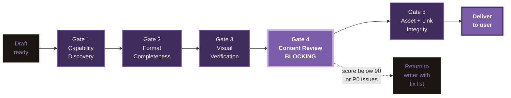

# Blog Delivery Contract: 5 gates

The v1.9.0 quality contract that every draft passes through before reaching
the user. Gate 4 (Content Review) is BLOCKING: the `blog-reviewer` agent must
return `BLOCKING: false` with score >= 90 and zero P0 issues, or the draft
returns to the writer.

## Gate-by-gate

| Gate | What it checks | Runner |
|---|---|---|
| 1. Capability Discovery | All sub-skills referenced in the draft are installed and callable | `scripts/blog_preflight.py --gate 1` |
| 2. Format Completeness | Markdown structure, frontmatter, required sections, word count | `scripts/blog_preflight.py --gate 2` |
| 3. Visual Verification | Hero image present, dimensions valid, alt text non-empty | `scripts/blog_preflight.py --gate 3` |
| 4. Content Review (BLOCKING) | E-E-A-T, AI-detection signals, citation depth, score >= 90 | `agents/blog-reviewer.md` (Task tool) |
| 5. Asset + Link Integrity | All internal links resolve, no broken images, JSON-LD valid | `scripts/blog_preflight.py --gate 5` |

A draft passing all 5 gates is delivered. A draft failing Gate 4 returns to
the writer with an explicit fix list (no auto-publish through that gate).
Gates 1, 2, 3, 5 run via `blog_preflight.py --strict`. Gate 4 is a separate
agent invocation, run BEFORE delivery, BLOCKING by design.

Full contract spec: `skills/blog/references/blog-delivery-contract.md`.
