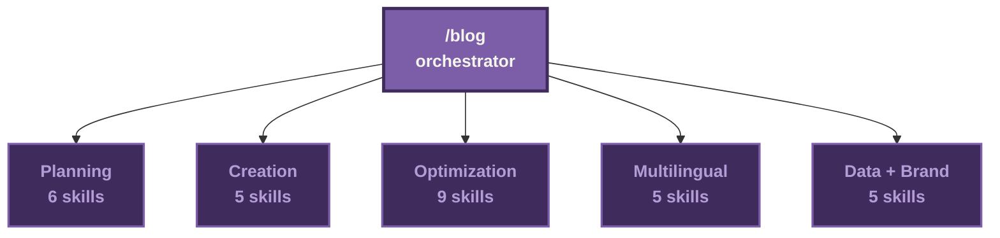

# Orchestrator Routing

How `/blog` dispatches to its 30 sub-skills, grouped by intent. The diagram
shows the 5 intent clusters with skill counts. The full sub-skill list lives
in the table below.

## Cluster intent and full skill list

| Cluster | When user invokes | Sub-skills |
|---|---|---|
| Planning | They have a topic but no article yet. Output: strategy, brief, outline, cluster plan | `/blog strategy`, `/blog calendar`, `/blog brief`, `/blog outline`, `/blog cluster`, `/blog persona` |
| Creation | They have a brief or outline. Output: drafted article, images, audio narration | `/blog write`, `/blog image`, `/blog audio`, `/blog chart`, `/blog taxonomy` |
| Optimization | They have a draft or published post. Output: improved post + verification reports | `/blog rewrite`, `/blog seo-check`, `/blog geo`, `/blog schema`, `/blog analyze`, `/blog factcheck`, `/blog cannibalization`, `/blog repurpose`, `/blog audit` |
| Multilingual | They have an English source. Output: published versions in N target locales with hreflang | `/blog multilingual`, `/blog translate`, `/blog localize`, `/blog locale-audit`, `/blog flow` |
| Data + Brand | They need external context. Output: API-fetched signals or brand voice files | `/blog google`, `/blog notebooklm`, `/blog brand`, `/blog discourse`, `/blog update` |

The orchestrator routes based on the verb the user typed (`write`, `audit`,
`analyze`, etc.) and any trailing arguments. Routing logic lives in
`skills/blog/SKILL.md`.
